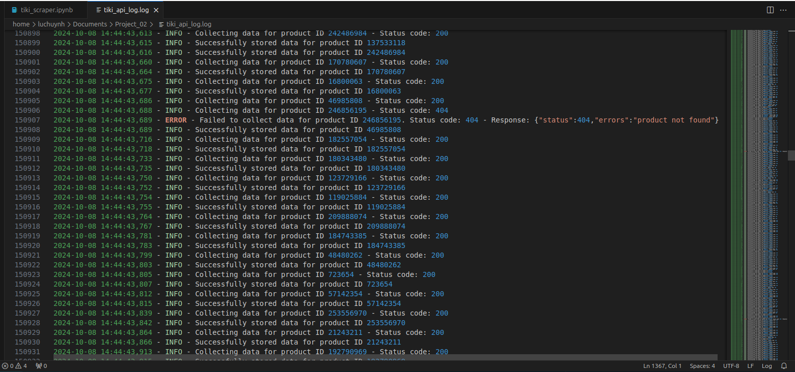

# Tiki Product Scraper

## Project Description
This project downloads approximately 200,000 products from Tiki and stores the information in MongoDB. The data fields collected include:
- `id`
- `name`
- `url_key`
- `price`
- `description`
- `images`

The IDs of each product are stored in the file `'200k_tiki_products.csv'`. Using these IDs, product data is retrieved from Tiki's API with the following format:  
`https://api.tiki.vn/product-detail/api/v1/products/<product_ID>`  

The project uses Python along with libraries like `pandas`, `requests`, `pymongo`, and `BeautifulSoup` to normalize content in the "description" field. It also implements multi-threading to reduce data retrieval time from the API.

## Working Environment
This project was developed and tested in the following environment:
- **Operating System**: Ubuntu (Version: Jammy)
- **Python**: 3.9.19

The project is expected to be compatible with other Linux distributions or Python versions, though minor adjustments may be required. MongoDB must be installed and properly configured for data storage.

## Libraries Used
- **pandas**: Reads CSV files and processes tabular data.
- **requests**: Sends HTTP requests to Tiki's API for product data.
- **pymongo**: Interacts with MongoDB to store product data.
- **bs4 (BeautifulSoup)**: Cleans and extracts text from HTML strings in product descriptions.
- **logging**: Logs details about the execution process, including HTTP request status and errors.
- **concurrent.futures (ThreadPoolExecutor, as_completed)**: Executes API requests concurrently to speed up data retrieval.

## Normalizing the 'description' Field
The `BeautifulSoup` library is used with `html.parser` and the `soup.get_text()` method to normalize the `description` field before storing it in MongoDB:
1. **Retrieve HTML data from the API**: The `description` field may contain various HTML tags and special characters.
2. **Normalize content**:
    - The `normalize_description` function uses `soup.get_text()` to extract only the text content, removing HTML tags and special characters.
    - The result is clean, readable text without any HTML tags.

## Performance Optimization
The project uses `ThreadPoolExecutor` to perform concurrent API requests:
- **Before multi-threading**: Each request is executed sequentially, leading to longer data retrieval time.
- **After using `ThreadPoolExecutor`**: Allows for multiple requests to be processed concurrently, significantly reducing the overall time for data collection.

### Benefits of `ThreadPoolExecutor` and `as_completed`:
- Reduces waiting time for each API request.
- Logs each request's completion immediately.
- Easy adjustment of the number of threads for optimal performance based on system configuration.

## Results
- Successfully collected approximately **200,000** product records and stored them in MongoDB in **70 minutes**.
- The process logs are saved in the file `'tiki_api_log.log'`.

### Visualization of the Results
Here are some images that illustrate the data collection process and results:

1. **Log Output**:
   
   - This image shows the log output generated during the data collection process.

2. **Product Not Found**:
   
   - This image illustrates a case where a product ID from the CSV file was not found in the Tiki API.

3. **Time to Finish**:
   
   - This image shows the time taken to collect approximately 200,000 product records, which was around 70 minutes.

4. **Total Data in MongoDB**:
   
   - This image provides a visualization of the collected data stored in MongoDB using MongoDB Compass.

## How to Use
1. Clone the project from GitHub:
   ```bash
   git clone https://github.com/yourusername/tiki-product-scraper.git
   cd tiki-product-scraper
   ```
2. Install required libraries:
   ```bash
   pip install -r requirements.txt
   ```
3. Run the program:
   ```bash
   python tiki_scraper.ipynb
   ```
   - Ensure that the `'200k_tiki_products.csv'` file is in the same directory as `tiki_scraper.py`.

## Directory Structure
```
tiki-product-scraper/ 
├── README.md
├── tiki_product_scraper/ 
│   ├── 200k_tiki_products.csv 
│   ├── tiki_scraper.ipynb 
│   ├── tiki_api_log.log 
│   ├── requirements.txt 
│   ├── images/ 
│   │   ├── Log.png 
│   │   ├── Product_not_found.png 
│   │   ├── Time_Finish.png 
│   │   └── Total_Data.png 
```

## Contributing
Contributions are welcome! Please open an issue or submit a pull request if you have any improvements or suggestions.
